# SeacondLife :smiley:

## First prototype

Figma [here :)](https://www.figma.com/file/gFI1fnjsRLRhrUmtEMtoKJ/SeacondLife?node-id=0%3A1&t=SyQxh8SxIIZ8BjUP-1) \
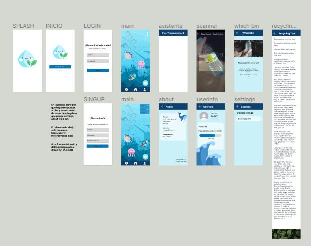

## Activities:
* [Splash](#item1)
* [Init](#item2)
* [Login](#item3)
* [SignUp](#item4)
* [Main](#item5)
* [About](#item6)
* [Setting](#item7)
* [Scanner](#item8)
* [Tips](#item9)

### Splash Activity :fireworks:

> SplashActivity con el logo con animación situado en fondo blanco. \
> Logo:  

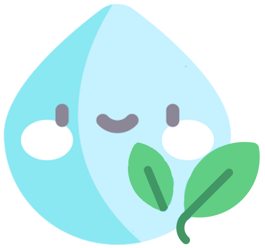

> código --> [here :3](https://github.com/6TenYi9/SeacondLife/blob/master/app/src/main/java/com/team/seacondlife/SplashActivity.kt) \
> layout --> [here :3](https://github.com/6TenYi9/SeacondLife/blob/master/app/src/main/res/layout/activity_splash.xml)  

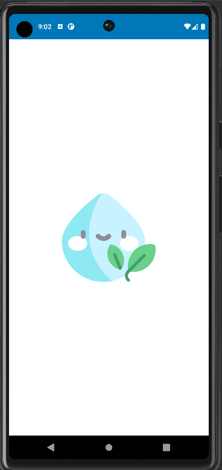

### Init Activity :herb:

> InitActivity con el logo y las opciones de registro y iniciar sesión. \
> código --> [here :3](https://github.com/6TenYi9/SeacondLife/blob/master/app/src/main/java/com/team/seacondlife/StartActivity.kt) \
> layout --> [here :3](https://github.com/6TenYi9/SeacondLife/blob/master/app/src/main/res/layout/activity_start.xml)  

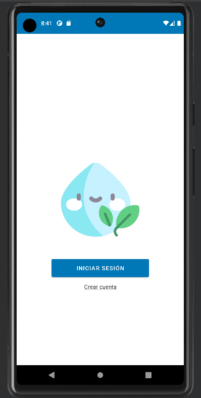

### Login Activity :smirk_cat:

> LoginActivity con campos de usuario y contraseña para iniciar sesión comprobación utilizando la base de datos local. \
> código -->[here :3](https://github.com/6TenYi9/SeacondLife/blob/master/app/src/main/java/com/team/seacondlife/LoginActivity.kt) \
> layout -->[here :3](https://github.com/6TenYi9/SeacondLife/blob/master/app/src/main/res/layout/activity_login.xml)  

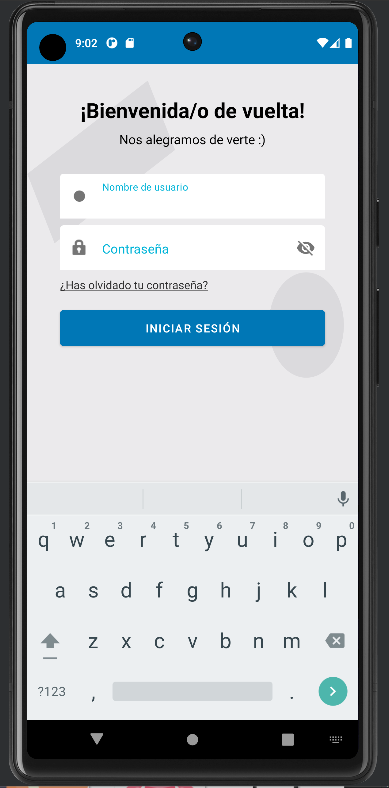

### SignUp Activity :feet:

> SignUpActivity con los campos de usuario,email,contraseña y su confirmación. Los datos se guardan en un base de datos local. \
> código -->[here :3](https://github.com/6TenYi9/SeacondLife/blob/master/app/src/main/java/com/team/seacondlife/SignUpActivity.kt) \
> layout -->[here :3](https://github.com/6TenYi9/SeacondLife/blob/master/app/src/main/res/layout/activity_sign_up.xml)  

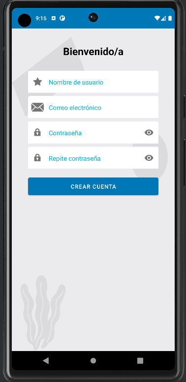

### Main Activity :whale2:

> MainActivity con la animación física de choque simulando peces flotando en el mar, es un fragment. \
> Tiene dos menús:   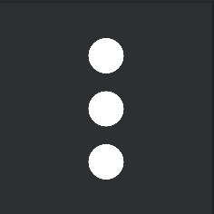 y    \
> código -->[here :3](https://github.com/6TenYi9/SeacondLife/blob/master/app/src/main/java/com/team/seacondlife/MainActivity.java) \
> layout -->[here :3](https://github.com/6TenYi9/SeacondLife/blob/master/app/src/main/res/layout/fragment_main.xml)  

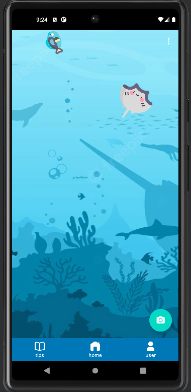

### About Activity :cat:

> AboutActivity con la información de los creadores. \
> código -->[here :3](https://github.com/6TenYi9/SeacondLife/blob/master/app/src/main/java/com/team/seacondlife/AboutActivity.kt) \
> main fragment code -->[here :3](https://github.com/6TenYi9/SeacondLife/blob/master/app/src/main/java/com/team/seacondlife/fragments/MainFragment.kt) \
> layout -->[here :3](https://github.com/6TenYi9/SeacondLife/blob/master/app/src/main/res/layout/activity_about.xml)  

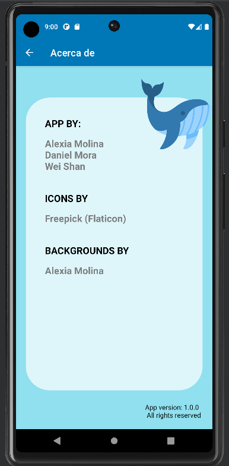

### Setting Activity :wrench:

> SettingActivity con las configuraciones de modo nocturno y la opción de idiomas. \
> código -->[here :3](https://github.com/6TenYi9/SeacondLife/blob/master/app/src/main/java/com/team/seacondlife/SettingsActivity.kt) \
> layout -->[here :3](https://github.com/6TenYi9/SeacondLife/blob/master/app/src/main/res/layout/activity_settings.xml)  

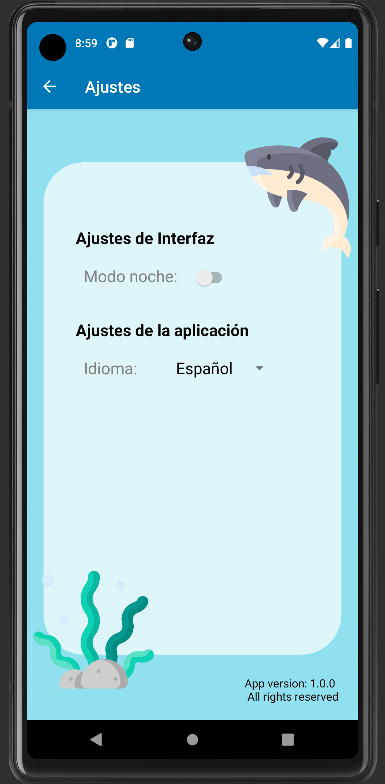

### Scanner Activity :mag_right:

> ScannerActivity con la opción de escanear el codigo y mostrar el resultado. \
> código -->[here :3](https://github.com/6TenYi9/SeacondLife/blob/master/app/src/main/java/com/team/seacondlife/codescanner/CodeScanner.kt) \
> layout -->[here :3](https://github.com/6TenYi9/SeacondLife/blob/master/app/src/main/res/layout/activity_code_scanner.xml)  

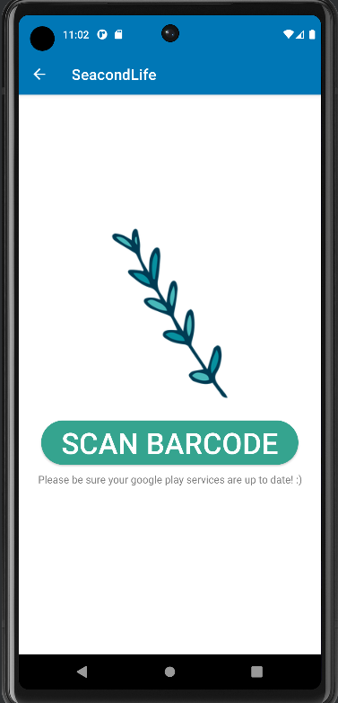

* #### ResultScanner :floppy_disk:

> Muestra el resultado del scanner. \
> código -->[here :3](https://github.com/6TenYi9/SeacondLife/blob/master/app/src/main/java/com/team/seacondlife/codescanner/ScannerResult.kt) \
> layout -->[here :3](https://github.com/6TenYi9/SeacondLife/blob/master/app/src/main/res/layout/activity_scanner_result.xml)  
* Escaneado con éxito:  
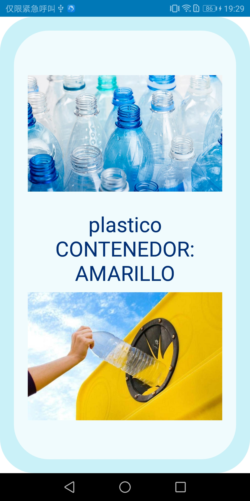
* Escaneado sin datos:  
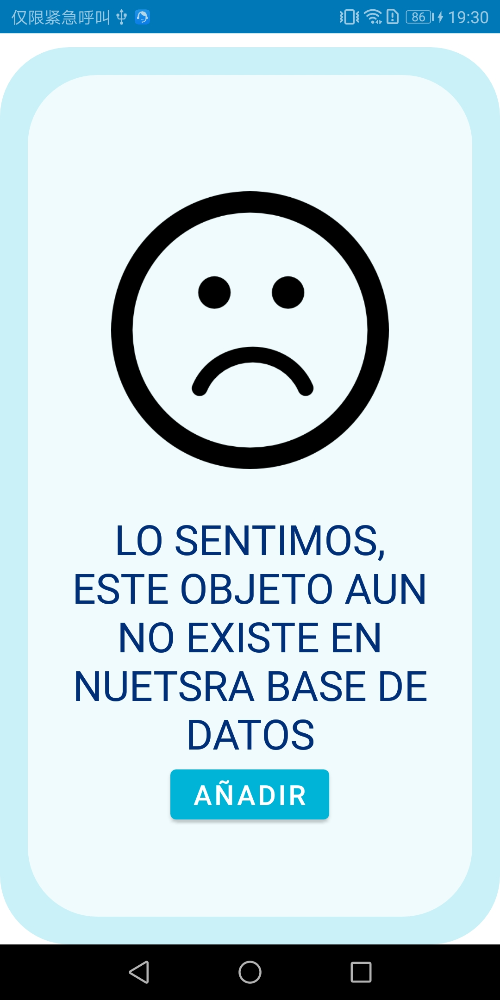
* Introducir datos:  
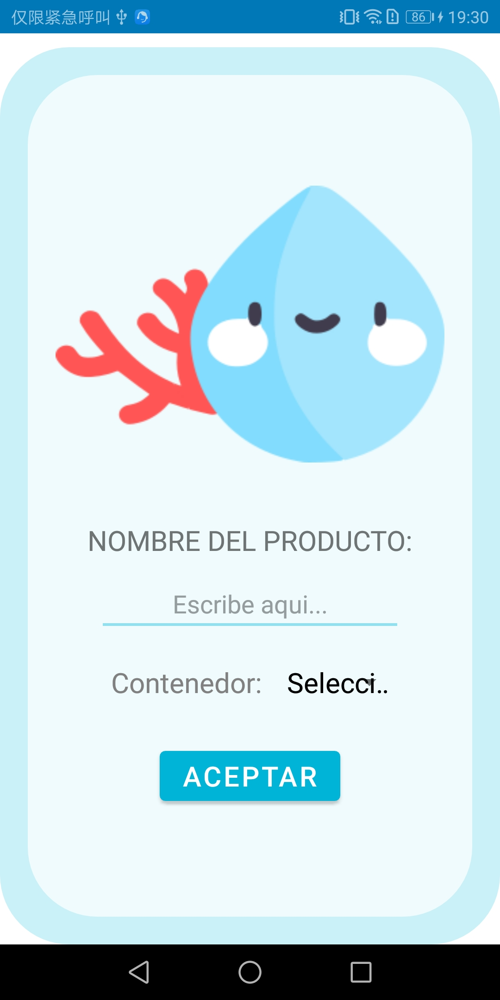

### Tips Fragment :white_check_mark:

> Muestra los consejos para hacer un buen reciclaje. \
> código -->[here :3](https://github.com/6TenYi9/SeacondLife/blob/master/app/src/main/java/com/team/seacondlife/fragments/TipsFragment.kt) \
> layout -->[here :3](https://github.com/6TenYi9/SeacondLife/blob/master/app/src/main/res/layout/fragment_tips.xml)  

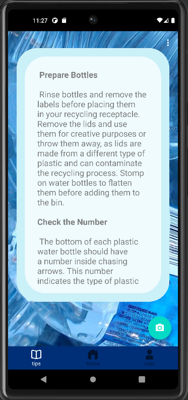