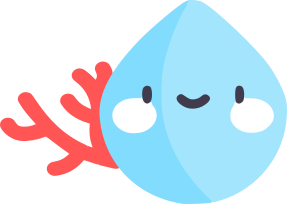
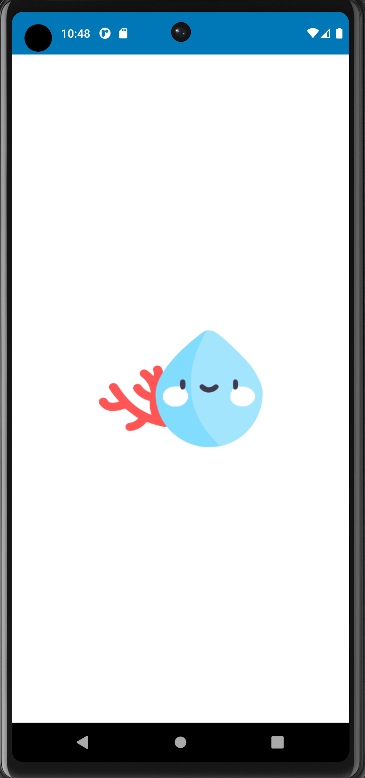
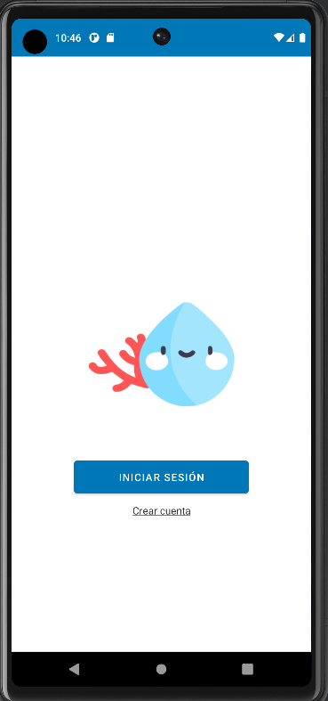
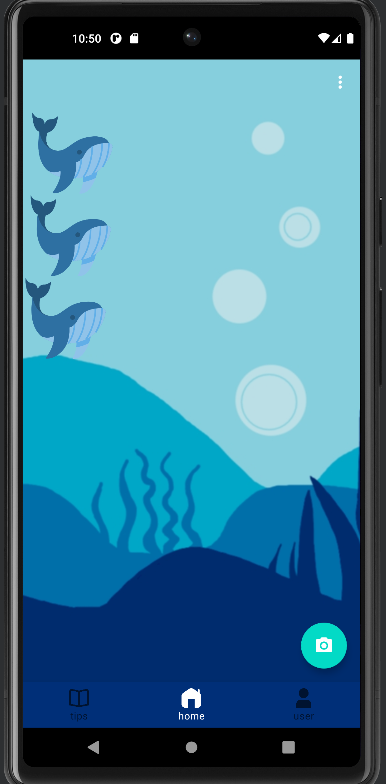

# SeacondLife :smiley:

## First prototype
>(user manual will be added when the app functions are complete)

Figma [here :)](https://www.figma.com/file/gFI1fnjsRLRhrUmtEMtoKJ/SeacondLife?node-id=0%3A1&t=SyQxh8SxIIZ8BjUP-1)

## Activities:
* [Splash](#item1)
* [Init](#item2)
* [Login](#item3)
* [SignUp](#item4)
* [Main](#item5)
* [About](#item6)
* [Setting](#item7)

### Splash Activity

> SplashActivity con el logo con animación situado en fondo blanco.
> Logo:

> código --> [here :3](https://github.com/6TenYi9/SeacondLife/blob/master/app/src/main/java/com/team/seacondlife/SplashActivity.kt)
> layout --> [here :3](https://github.com/6TenYi9/SeacondLife/blob/master/app/src/main/res/layout/activity_splash.xml)

### Init Activity

> InitActivity con el logo y las opciones de registro y iniciar sesión.
> código --> [here :3](https://github.com/6TenYi9/SeacondLife/blob/master/app/src/main/java/com/team/seacondlife/StartActivity.kt)
> layout --> [here :3](https://github.com/6TenYi9/SeacondLife/blob/master/app/src/main/res/layout/activity_start.xml)

### Login Activity

> LoginActivity con campos de usuario y contraseña para iniciar sesión comprobación utilizando la base de datos local.
> código -->[here :3](https://github.com/6TenYi9/SeacondLife/blob/master/app/src/main/java/com/team/seacondlife/LoginActivity.kt)
> layout -->[here :3](https://github.com/6TenYi9/SeacondLife/blob/master/app/src/main/res/layout/activity_login.xml)

### SignUp Activity

> SignUpActivity con los campos de usuario,email,contraseña y su confirmación. Los datos se guardan en un base de datos local.
> código -->[here :3](https://github.com/6TenYi9/SeacondLife/blob/master/app/src/main/java/com/team/seacondlife/SignUpActivity.kt)
> layout -->[here :3](https://github.com/6TenYi9/SeacondLife/blob/master/app/src/main/res/layout/activity_sign_up.xml)

### Main Activity

> MainActivity con la animación física de choque simulando peces flotando en el mar, es un fragment.
> Tiene dos menús:  y 
> código -->[here :3](https://github.com/6TenYi9/SeacondLife/blob/master/app/src/main/java/com/team/seacondlife/MainActivity.java)
> layout -->[here :3](https://github.com/6TenYi9/SeacondLife/blob/master/app/src/main/res/layout/fragment_main.xml)

### About Activity

> AboutActivity con la información de los creadores.
> código -->[here :3](https://github.com/6TenYi9/SeacondLife/blob/master/app/src/main/java/com/team/seacondlife/AboutActivity.kt)
> main fragment code -->[here :3](https://github.com/6TenYi9/SeacondLife/blob/master/app/src/main/java/com/team/seacondlife/fragments/MainFragment.kt)
> layout -->[here :3](https://github.com/6TenYi9/SeacondLife/blob/master/app/src/main/res/layout/activity_about.xml)

### Setting Activity

> SettingActivity con las configuraciones de modo nocturno y la opción de idiomas.
> código -->[here :3](https://github.com/6TenYi9/SeacondLife/blob/master/app/src/main/java/com/team/seacondlife/SettingsActivity.kt)
> layout -->[here :3](https://github.com/6TenYi9/SeacondLife/blob/master/app/src/main/res/layout/activity_settings.xml)

